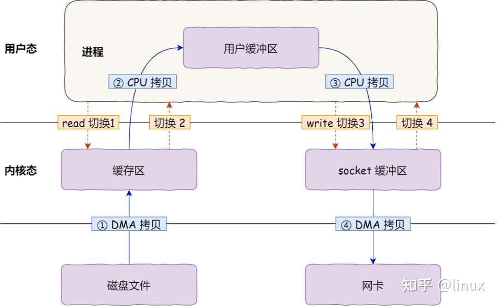
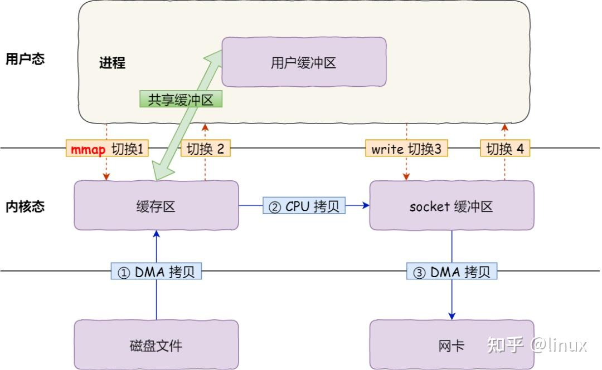

# Overview

传统的数据拷贝：

上图中的操作：
上下文操作：
* 上下文切换发生四次，因为有两个系统调用：每次系统调用都要先用户态切换到内核态，内核完成任务后，再内核态切换到用户态
* 上下文操作是有成本的，一次切换可能需要十几微秒到几百微秒
数据拷贝：
* 第一次拷贝，把磁盘上的数据拷贝到操作系统内核的缓冲区里，这个拷贝的过程是通过 DMA 搬运的。
* 第二次拷贝，把内核缓冲区的数据拷贝到用户的缓冲区里，于是我们应用程序就可以使用这部分数据了，这个拷贝到过程是由 CPU 完成的。
* 第三次拷贝，把刚才拷贝到用户的缓冲区里的数据，再拷贝到内核的 socket 的缓冲区里，这个过程依然还是由 CPU 搬运的。
* 第四次拷贝，把内核的 socket 缓冲区里的数据，拷贝到网卡的缓冲区里，这个过程又是由 DMA 搬运的。

性能调优，减少上下文切换以及拷贝次数

# 零拷贝

## mmap+write

mmap+write的拷贝数据流:

mmap() 系统调用函数会直接把内核缓冲区里的数据「映射」到用户空间，这样，操作系统内核与用户空间就不需要再进行任何的数据拷贝操作。

具体过程如下：
* 应用进程调用了 mmap() 后，DMA 会把磁盘的数据拷贝到内核的缓冲区里。接着，应用进程跟操作系统内核「共享」这个缓冲区；
* 应用进程再调用 write()，操作系统直接将内核缓冲区的数据拷贝到 socket 缓冲区中，这一切都发生在内核态，由 CPU 来搬运数据；
* 最后，把内核的 socket 缓冲区里的数据，拷贝到网卡的缓冲区里，这个过程是由 DMA 搬运的。

优化：
* 减少了一次拷贝

## sendfile