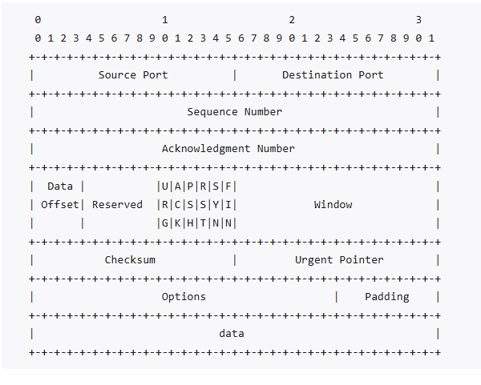
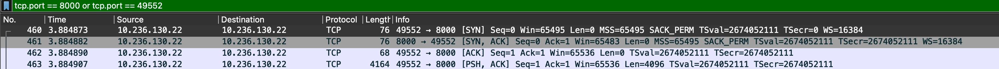
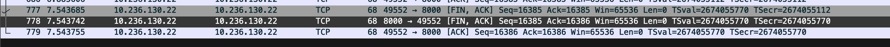
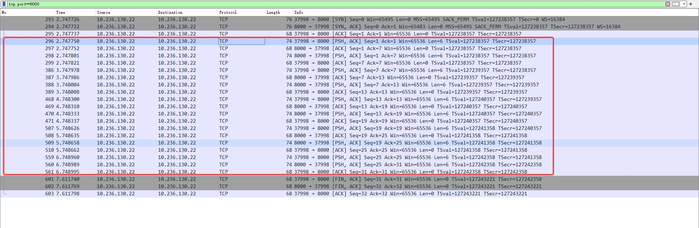

# Overview

# TCP协议格式

其中：
* seq(Sequence Number)：32bits，表示这个tcp包的序列号。
  * 1. 标识当前数据包的第一个字节在数据流中的位置，
  * 2. tcp协议拼凑接收到的数据包时，根据seq来确定顺序，并且能够确定是否有数据包丢失。
* ack(Acknowledgment Number)：32bits，表示这个包的确认号。
  * 1. 首先意味着已经收到对方了多少字节数据
  * 2. 其次告诉对方接下来的包的seq要从ack确定的数值继续接力。
  * 3. 比如ack=1100，表示以及收到对方发送的seq=0~seq=1099的数据，期望下一帧对端发送的数据seq=1100
* PSH：Push Function
  * 告诉接收方的TCP协议栈，请立即将本文报文中的数据推送到应用层，不要在缓冲等待更多数据。
  * 适用用需要实时响应的场景
* Window：16bit
  * 表示本端还能接收的数据字节数
  * 但是由于现代网络带宽跟延迟变大，16bit最大值为65535，远远不够，因此引入了`窗口缩放`(Window Scaling)
    * 1. Window：TCP头部报文的原始窗口值(如32678)，最大值为65535
    * 2. Window size scaling factor：窗口缩放因子（如 4）
    * 3. Calculated window size：实际可用窗口大小，等于 Window × (scaling factor)。

## wireshark抓包

* TSval：表示发送方当前的时间戳
* TSecr：表示对方上一次发送过来的TSval，即`时间戳回显`
  * 例如：
  * A发送给B的数据包中：TSval=1000，TSecr=0(第一次没有回显)
  * B回复给A的数据包：TSval=2000(B当前时间)，TSecr=1000(回显A的TSval)
  * A再发包给B：TSval=1100(A当前时间)，TSecr=2000(回显B的TSval)

## 重传机制

通过seq跟ack，可以判断是否数据丢失

* 超时重传：设置定时器，超过指定时间没有收到对方的ack，就重发该数据

## 滑动窗口

tcp中数据传输类似一问一答方式，这种方式在数据包往返时间较长的情况下，效率会很低，因此提出了`窗口`：
* 指定一个窗口，无需等待确认应答，而可以继续发送数据的最大值

## 流量控制

发送发不能无脑的发送数据，如果一直无脑发送数据，但对方处理不过来，就会触发超时重传的机制，导致网络流量无端的浪费

# 三次握手

* 一次握手:客户端发送带有 SYN（SEQ=x） 标志的数据包 -> 服务端，然后客户端进入 SYN_SEND 状态，等待服务端的确认；
* 二次握手:服务端发送带有 SYN+ACK(SEQ=y,ACK=x+1) 标志的数据包 –> 客户端,然后服务端进入 SYN_RECV 状态；
* 三次握手:客户端发送带有 ACK(ACK=y+1) 标志的数据包 –> 服务端，然后客户端和服务端都进入ESTABLISHED 状态，完成 TCP 三次握手。

以下是wireshark抓包得到的数据：

分析：
* 第一帧：
  * 1. seq=0表示这是一个新的开始；
  * 2. 没有ack是因为还没有收到数据；
  * 3. Len=0表示我没有传输数据，只是一个建立连接的包
* 第二帧：
  * 1. seq=0
  * 2. ack=1：首先我收到了第一帧，其次告诉客户端下一帧要按照seq=1发过来
  * 3. Len=0：表示没有发数据
* 第三帧：
  * 1. seq=1：响应上述的包中的ack
  * 2. ack=1：表示我收到了你的seq=0的同意连接，下一帧你也按照seq=1发送过来
  * 3. len=0：表示没有发送数据

## 半连接和全连接

tcp三次握手过程中，linux内核会维护两个队列来管理：
* 1. 半连接队列：当服务端收到SYN包文，此时双方还未建立连接，内核会把半连接的状态的连接放到半连接队列中
* 2. 全连接队列：
  * 当服务端收到客户端对 ACK 响应时，意味着三次握手成功完成，服务端会将该连接从半连接队列移动到全连接队列。
  * 如果未收到客户端的 ACK 响应会进行重传，重传的等待时间通常是指数增长的。如果重传次数超过系统规定的最大重传次数，系统将从半连接队列中删除该连接信息。

## 必要性

三次握手的目的是建立可靠的通信信道，说到通讯，简单来说就是数据的发送与接收，而三次握手最主要的目的就是双方确认自己与对方的发送与接收是正常的。
* 1. 第一次握手：
  * Client 什么都不能确认；
  * Server 确认了对方发送正常，自己接收正常
* 2. 第二次握手：
  * Client 确认了：自己发送、接收正常，对方发送、接收正常；
  * Server 确认了：对方发送正常，自己接收正常
* 3. 第三次握手：
  * Client 确认了：自己发送、接收正常，对方发送、接收正常；
  * Server 确认了：自己发送、接收正常，对方发送、接收正常

# 四次挥手

断开一个 TCP 连接则需要“四次挥手”，缺一不可：
* 1. 第一次挥手：客户端发送一个 FIN（SEQ=x） 标志的数据包->服务端，用来关闭客户端到服务端的数据传送。然后客户端进入 FIN-WAIT-1 状态。
* 2. 第二次挥手：服务端收到这个 FIN（SEQ=X） 标志的数据包，它发送一个 ACK （ACK=x+1）标志的数据包->客户端 。然后服务端进入 CLOSE-WAIT 状态，客户端进入 FIN-WAIT-2 状态。
* 3. 第三次挥手：服务端发送一个 FIN (SEQ=y)标志的数据包->客户端，请求关闭连接，然后服务端进入 LAST-ACK 状态。
* 4. 第四次挥手：客户端发送 ACK (ACK=y+1)标志的数据包->服务端，然后客户端进入TIME-WAIT状态，服务端在收到 ACK (ACK=y+1)标志的数据包后进入CLOSE 状态。此时如果客户端等待 2MSL 后依然没有收到回复，就证明服务端已正常关闭，随后客户端也可以关闭连接了。

只要四次挥手没有结束，客户端和服务端就可以继续传输数据！这是wirkshark的抓包数据：

**注意**
wireshark中四次挥手显示三次：
这是因为服务端的两次回复被放到一个包了

## 为什么四次挥手

TCP 是全双工通信，可以双向传输数据。任何一方都可以在数据传送结束后发出连接释放的通知，待对方确认后进入半关闭状态。当另一方也没有数据再发送的时候，则发出连接释放通知，对方确认后就完全关闭了 TCP 连接。

## 等待2MSL

第四次挥手时，客户端发送给服务端的 ACK 有可能丢失，如果服务端因为某些原因而没有收到 ACK 的话，服务端就会重发 FIN，如果客户端在 2*MSL 的时间内收到了 FIN，就会重新发送 ACK 并再次等待 2MSL，防止 Server 没有收到 ACK 而不断重发 FIN。

MSL(Maximum Segment Lifetime) : 一个片段在网络中最大的存活时间，2MSL 就是一个发送和一个回复所需的最大时间。如果直到 2MSL，Client 都没有再次收到 FIN，那么 Client 推断 ACK 已经被成功接收，则结束 TCP 连接。

# 通信期间

当客户端跟服务端握手成功，并建立连接后，其数据通信相关的以太网报文抓了一下，大致如图片所示：

* 第一帧：
  * 1. seq=1：对应握手时候的服务端的ack=1
  * 2. ack=1：表示期望服务端发送数据中seq=1
  * 3. len=6：数据长度为6
* 第二帧：
  * 1. ack帧
  * 2. seq=1：对应第一帧中客户端的ack=1
  * 3. ack=7：表示服务端已经收到了6字节的数据，期望客户端下一帧数据seq=7，接收剩余数据
  * 4. Len=0：表示不带数据
* 第五帧：
  * 1. seq=7：表示当前客户端当前发送数据从seq=7开始，也对应了第二帧中的ack=7
  * 2. ack=7
  * 3. len=6：数据长度为6

